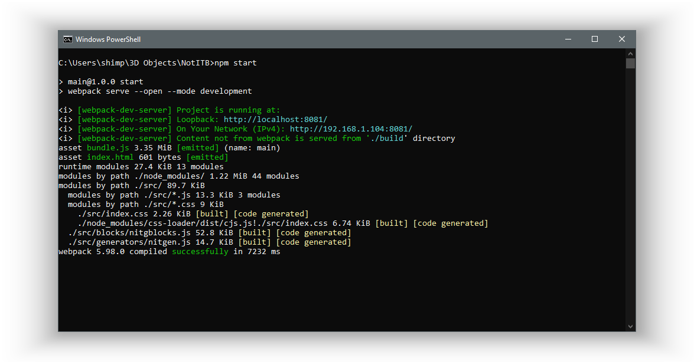

# NotITB

Uh, blockly thingy i dunno

## What is NotITB?

It's a sorta blockly project to make uh NotITG Modfiles and stuff, not to make complete complex modcharts or anything but something just.. functional

## Why is NotITB?

I'm too lazy to write modcharts and besides there are others who don't know what's a default.xml file and why do they need it in a "Lua" folder, nor why Lua is stored in an XML file.

Or perhaps there are other lazy people which don't wanna go through the hassle of writing a modfile. Which is.. i don't know?

## How to NotITB?

Just download source, extract it into any folder, enter it such that you're above `/src` and `node_modules`.  
Then open terminal, and start it by typing in `npm start`.

If there's an uninstalled dependency.. Just search how to download it online dude, even a 8 year old could do it, not that he should though

## There's Mirin Template

I know i know, it's easier and more intuitive and stuff. And i have no excuse, i just didn't know about it when starting and.. well, yeah

Not that i'm regretting it, i prefer clicking blocks together than to read a wiki every time i need to do something ( Lazyness )

## Thanks!

This was made possible thanks to the help of the following people below!

Maribeth  
Mark
